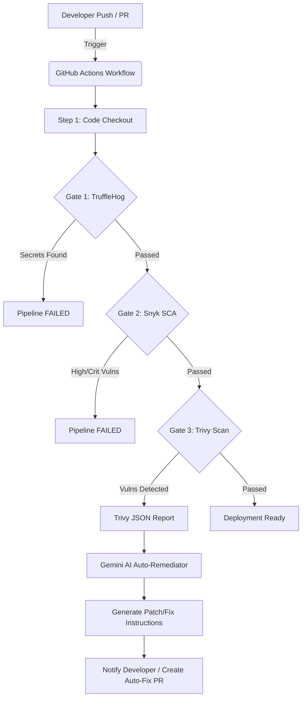

# 🎨 PixelCraft AI

**PixelCraft AI** is a state-of-the-art Web Application offering a comprehensive suite of free AI-powered image editing tools. From background removal to advanced image manipulation, PixelCraft provides a seamless and responsive user experience built with modern web technologies.

---

## 🚀 Advanced DevSecOps CI/CD Pipeline

While PixelCraft AI delivers powerful frontend features, its core engineering marvel lies in its **Security-First DevSecOps Pipeline**. We have implemented an automated, multi-gate CI/CD infrastructure leveraging **GitHub Actions**, cutting-edge security scanners, and **GenAI-powered auto-remediation**.

Our pipeline ensures that zero hardcoded secrets, no vulnerable dependencies, and no infrastructure misconfigurations make it to production.

### 🏗️ CI/CD Architecture Flow

Below is the architectural representation of our automated CI/CD and security remediation workflow:



### 🛡️ Deep Dive: Security Gates & Automation

Our CI/CD pipeline orchestrates the following security gates synchronously upon every `push` and `pull_request` to the `main` branch.

#### 1. Pre-commit & Secret Scanning (TruffleHog)
- **Tool**: `trufflesecurity/trufflehog`
- **Objective**: Prevents API keys, passwords, and sensitive tokens from being leaked into the repository history.
- **Mechanism**: Performs a deep, entropy-based scan across the entire repository snapshot. Any detected secret immediately halts the pipeline (Fail-Fast methodology).

#### 2. Software Composition Analysis - SCA (Snyk)
- **Tool**: `snyk/actions/node`
- **Objective**: Audits third-party open-source dependencies (e.g., `zod`, `lodash`) for known vulnerabilities (CVEs).
- **Mechanism**: Configured with a strict `--severity-threshold=high`. The pipeline will automatically fail if any High or Critical vulnerabilities are detected in the dependency tree, preventing supply chain attacks.

#### 3. AI-Powered Auto-Remediation (Custom Gemini Script)
- **Script**: `scripts/ai_remediator.py`
- **Objective**: Not just finding vulnerabilities, but automatically fixing them.
- **Mechanism**: 
  1. Reads output from **Trivy** vulnerability scanners (`trivy-results.json`).
  2. Ingests the JSON payload and interfaces with the **Google Gemini 1.5 Flash API**.
  3. The LLM acts as an automated DevSecOps engineer, analyzing the vulnerability and generating exact CLI commands or code snippets to patch the issue.
  4. This drastically reduces Mean Time To Remediation (MTTR).

### 📂 CI/CD Directory Structure

```text
PixelCraft_AI/
├── .github/
│   └── workflows/
│       └── devsecops.yml       # Core GitHub Actions CI/CD pipeline definition
├── scripts/
│   └── ai_remediator.py        # Gemini API script for AI-driven vulnerability patching
├── scratch_imgly/
│   ├── package.json            # Node.js dependencies (monitored by Snyk)
│   └── package-lock.json       # Dependency lockfile
├── .env                        # Environment variables (Excluded from git)
└── public/                     # Static assets and Web App Frontend
```

### ⚙️ How It Works in Practice

1. **Continuous Integration**: When a developer pushes code, GitHub Actions spins up an `ubuntu-latest` runner.
2. **Security Audit**: TruffleHog scans the commit history. Snyk analyzes `package.json`.
3. **Vulnerability Handling**: If Snyk or Trivy flag a vulnerability, the pipeline logs the failure.
4. **Auto-Remediation**: The `ai_remediator.py` script is triggered. It passes the vulnerability report to Gemini AI, which responds with the exact command (e.g., `npm update zod`) to resolve the CVE.
5. **Continuous Delivery**: Only when all security gates pass successfully is the code considered stable and ready for the next deployment phase.

---
*Built with ❤️ focusing on Security and Artificial Intelligence.*
