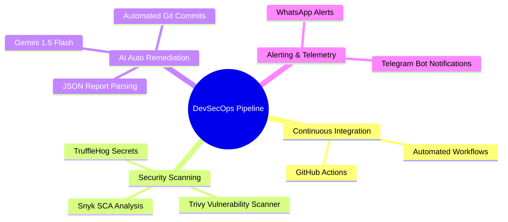
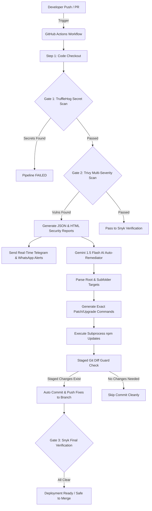

# PixelCraft AI - Secured with Advanced DevSecOps Pipeline

[](https://github.com/)
[](https://github.com/)
[](https://generativelanguage.googleapis.com/)
[](LICENSE)

**PixelCraft AI** is an enterprise-grade web application offering a comprehensive suite of AI-powered image editing tools. Engineered with a **Security-First Architecture**, the repository is continuously audited and auto-patched using a custom GenAI-driven DevSecOps pipeline.

---

## DevSecOps Pipeline Architecture


While PixelCraft AI delivers frontend capabilities, its core engineering foundation relies on an automated, multi-gate CI/CD infrastructure leveraging **GitHub Actions**, enterprise security scanners, and **GenAI-powered auto-remediation**.

The pipeline enforces zero hardcoded secrets, zero unpatched vulnerability dependencies across all severities (Critical, High, Medium, Low), and strict compliance checks prior to deployment.

---

## DevSecOps Integration Mind Map



---

## CI/CD Architecture Flow

Below is the architectural representation of our automated CI/CD and security remediation workflow:



---

## Security Gates Breakdown

Our CI/CD pipeline orchestrates the following security gates synchronously upon every `push` and `pull_request` to the `main` or `feature/*` branches:

### 1. Pre-commit & Secret Scanning (TruffleHog)
* **Engine:** `trufflesecurity/trufflehog`
* **Objective:** Prevents API keys, private keys, passwords, and sensitive tokens from being leaked into repository history.
* **Mechanism:** Performs entropy-based scanning across the entire repository snapshot. Any detected secret immediately halts the pipeline (Fail-Fast methodology).

### 2. Software Composition Analysis - SCA (Trivy & Snyk)
* **Engines:** `aquasecurity/trivy-action` & `snyk/actions/node`
* **Coverage:** All severity levels (**CRITICAL, HIGH, MEDIUM, LOW**) across both root and nested subfolder manifests (e.g., `package-lock.json`, `scratch_imgly/package-lock.json`).
* **Mechanism:** Scans open-source dependency trees for known CVEs and prototype pollution vectors (resolving GitHub Dependabot security alerts automatically).

### 3. AI-Powered Auto-Remediation & Self-Healing Engine (Gemini 1.5 Flash)
* **Engine Script:** `scripts/ai_remediator.py`
* **Secret Token:** `GEMINI_API_KEY` (Stored in GitHub Repository Secrets)
* **Objective:** Automatically resolves code & package failures without human developer intervention.
* **Failure Resolution Mechanism:**
  1. **Failure Interception:** When Trivy detects CVEs in `trivy-results.json`, the pipeline triggers `scripts/ai_remediator.py`.
  2. **Trivy JSON Parsing:** The script parses `trivy-results.json`, extracting Target Files (e.g. `package-lock.json` or `scratch_imgly/package-lock.json`), Package Names, Installed Versions, and Fixed Versions.
  3. **Gemini API Key Authentication:** Reads `GEMINI_API_KEY` from environment variables and constructs an authenticated HTTPS payload to `https://generativelanguage.googleapis.com/v1beta/models/gemini-1.5-flash:generateContent`.
  4. **Subfolder-Aware Prompt Engineering:** Gemini 1.5 Flash evaluates the target paths. If a vulnerability resides in a subfolder (e.g., `scratch_imgly/`), Gemini outputs scoped directory commands: `cd scratch_imgly && npm install package@version --save --legacy-peer-deps && cd ..`.
  5. **Subprocess Auto-Patching:** Python's `subprocess.run()` executes the AI-generated commands in real-time on the `ubuntu-latest` runner.
  6. **Staged Git Diff Guard:** Executes `git diff --staged --quiet` after staging `package.json`. If untracked ~1.1GB Trivy database caches exist, they are filtered out, ensuring clean, isolated commits.

### 4. Automated HTML & Markdown Security Reports
* **HTML Artifacts:** Generates structured `trivy-report.html` files uploaded as GitHub Actions artifacts (`trivy-report-html`), allowing developers to download visual audit reports directly.
* **GitHub Step Summaries:** Dynamically renders formatted vulnerability tables in the workflow run summary for instant visibility.

### 5. Multi-Channel Real-time Telemetry (Telegram & WhatsApp)
* **Integration:** Integrated via Telegram Bot API (`TELEGRAM_BOT_TOKEN`, `TELEGRAM_CHAT_ID`) & CallMeBot API.
* **Telemetry Mechanism:** 
  1. Executes a dedicated Python telemetry script inside `devsecops.yml`.
  2. Sanitizes `TELEGRAM_BOT_TOKEN` automatically (stripping `bot` prefixes or trailing whitespace).
  3. Sends plain-text formatted payloads directly to Telegram, eliminating entity parsing 400 errors while maintaining clickable GitHub Actions run links.
  4. Triggers instant mobile push alerts with execution status upon every pipeline trigger.

---

## Directory Structure

```text
PixelCraft_AI/
├── .github/
│   └── workflows/
│       └── devsecops.yml       # Complete GitHub Actions CI/CD pipeline definition
├── scripts/
│   └── ai_remediator.py        # Gemini 1.5 Flash AI script for vulnerability auto-patching
├── scratch_imgly/
│   ├── package.json            # Subfolder Node.js package (Monitored & Auto-Remediated)
│   └── package-lock.json       # Subfolder lockfile
├── public/                     # Static assets and Web App Frontend
├── package.json                # Root Node.js dependencies
└── README.md                   # Technical DevSecOps Documentation
```

---

## Execution Workflow

1. **Trigger Event:** A developer pushes code or submits a Pull Request.
2. **Security Audit:** TruffleHog checks for leaked keys; Trivy scans root and subfolder lockfiles across all severities.
3. **AI Remediation:** If vulnerabilities are found, `ai_remediator.py` requests precise update commands from Gemini 1.5 Flash, runs them locally on the runner, and commits only the modified `package.json` files.
4. **Final Verification:** Snyk runs a final verification check to ensure zero high-severity CVEs remain before declaring the branch safe for merge.

---

## License

This project is licensed under the [MIT License](LICENSE).
