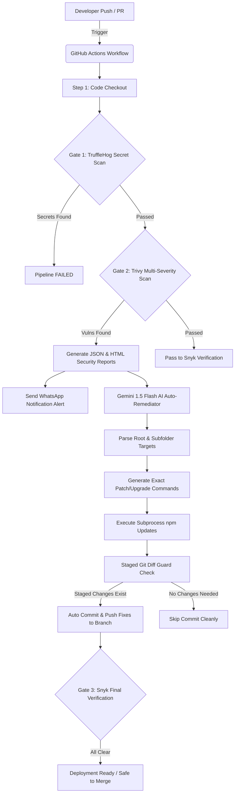

# 🎨 PixelCraft AI

**PixelCraft AI** is a state-of-the-art Web Application offering a comprehensive suite of free AI-powered image editing tools. From background removal to advanced image manipulation, PixelCraft provides a seamless and responsive user experience built with modern web technologies.

---

## 🚀 Advanced DevSecOps CI/CD Pipeline

While PixelCraft AI delivers powerful frontend features, its core engineering marvel lies in its **Security-First DevSecOps Pipeline**. We have implemented an automated, multi-gate CI/CD infrastructure leveraging **GitHub Actions**, cutting-edge security scanners, and **GenAI-powered auto-remediation**.

Our pipeline ensures that zero hardcoded secrets, no vulnerable dependencies, and no infrastructure misconfigurations make it to production.

### 🏗️ CI/CD Architecture Flow

Below is the architectural representation of our automated CI/CD and security remediation workflow:



### 🛡️ Deep Dive: Security Gates & Automation

Our CI/CD pipeline orchestrates the following security gates synchronously upon every `push` and `pull_request` to the `main` or `feature/*` branches:

#### 1. Pre-commit & Secret Scanning (TruffleHog)
- **Tool**: `trufflesecurity/trufflehog`
- **Objective**: Prevents API keys, private keys, passwords, and sensitive tokens from being leaked into the repository history.
- **Mechanism**: Performs a deep, entropy-based scan across the entire repository snapshot. Any detected secret immediately halts the pipeline (Fail-Fast methodology).

#### 2. Software Composition Analysis - SCA (Trivy & Snyk)
- **Tools**: `aquasecurity/trivy-action` & `snyk/actions/node`
- **Coverage**: All severity levels (**CRITICAL, HIGH, MEDIUM, LOW**) across both root and nested subfolder manifests (e.g., `package-lock.json`, `scratch_imgly/package-lock.json`).
- **Mechanism**: Scans open-source dependency trees for known CVEs and prototype pollution vectors (resolving GitHub Dependabot security alerts automatically).

#### 3. AI-Powered Auto-Remediation (Gemini 1.5 Flash)
- **Script**: `scripts/ai_remediator.py`
- **Objective**: Automatically fix vulnerable dependencies without human manual effort.
- **Mechanism**:
  1. **Trivy JSON Parsing**: Ingests `trivy-results.json` and extracts targets, package names, installed versions, and fixed versions.
  2. **Subfolder Awareness**: Identifies nested package locations (e.g. `scratch_imgly/`) and generates scoped execution commands (`cd scratch_imgly && npm install ...`).
  3. **Gemini 1.5 Flash Integration**: Uses Google's Gemini 1.5 Flash API to craft precise CLI patch commands with strict `--legacy-peer-deps` safeguards.
  4. **Subprocess Execution**: Safely executes patch commands in Python subprocesses.
  5. **Staged Diff Git Protection**: Evaluates `git diff --staged --quiet` to ensure only valid package file changes are committed, ignoring untracked build caches or temp files.

#### 4. Automated HTML & Markdown Security Reports
- **HTML Artifacts**: Generates structured `trivy-report.html` files uploaded as GitHub Actions artifacts (`trivy-report-html`), allowing developers to download visual audit reports directly.
- **GitHub Step Summaries**: Dynamically renders formatted vulnerability tables in the workflow run summary for instant visibility.

#### 5. Instant WhatsApp Notifications
- **Integration**: Integrated via CallMeBot API (`WHATSAPP_PHONE` & `WHATSAPP_API_KEY` secrets).
- **Functionality**: Triggers instant push notifications to the repository owner's mobile device whenever vulnerabilities are detected, including direct links to the GitHub Action run.

---

### 📂 CI/CD Directory Structure

```text
PixelCraft_AI/
├── .github/
│   └── workflows/
│       └── devsecops.yml       # Complete GitHub Actions CI/CD pipeline definition
├── scripts/
│   └── ai_remediator.py        # Gemini 1.5 Flash AI script for vulnerability auto-patching
├── scratch_imgly/
│   ├── package.json            # Subfolder Node.js package (Monitored & Auto-Remediated)
│   └── package-lock.json       # Subfolder lockfile
├── public/                     # Static assets and Web App Frontend
├── package.json                # Root Node.js dependencies
└── README.md                   # Comprehensive DevSecOps Documentation
```

### ⚙️ How It Works in Practice

1. **Push Event**: A developer pushes code or submits a Pull Request.
2. **Security Audit**: TruffleHog checks for leaked keys; Trivy scans root and subfolder lockfiles across all severities.
3. **AI Remediation**: If vulnerabilities are found, `ai_remediator.py` asks Gemini 1.5 Flash for the exact update commands, runs them locally on the runner, and commits only the modified `package.json` files.
4. **Final Verification**: Snyk runs a final verification check to ensure zero high-severity CVEs remain before declaring the branch safe for merge.

---
*Built with ❤️ focusing on Security, Automation, and Artificial Intelligence.*
